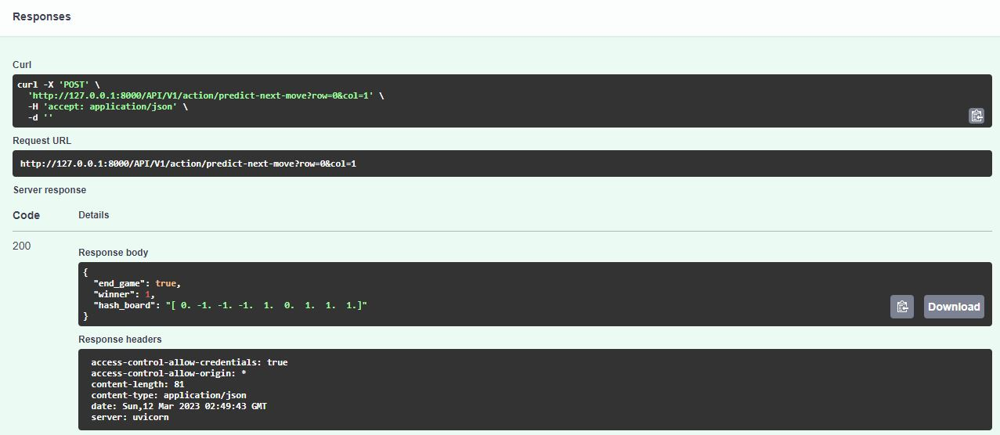

# TIC TAC TOE - Backend
Author: Diego Steven Vera Vilca

_Api services used for the project TicTacToe, contains the algorithm to predict the the computer move. It was created with Reinforcement Learning._

## Requirements
All the libraries used in the project are in requirements.txt.

```bash
pip install -r requirements.txt
```

## Run the project
* Run the command:
```bash
uvicorn main:app --reload
```
* Will be launch on http://127.0.0.1:8000/
* You can try the API model on http://127.0.0.1:8000/docs#/Action/next_move_ai_API_V1_action_predict_next_move_post
* Set the position in the row and column of the board in the post api. The response could be like the next image:

